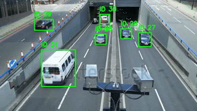

# Multiple Object Tracking with Re-ID

This repository contains `tracking.py`, which implements the BoxSort tracker for multiple object tracking with Re-Identification (Re-ID).  
I chose BoxSort over DeepSort because it includes a Re-ID model that helps maintain consistent IDs for the same object, even if the object is missing or occluded for several frames.  
Specifically, the `osnet_x0_25_market50` Re-ID model is used for faster inference without significant loss in accuracy.

---

## Setup Instructions

1. Clone this repository or place your `tracking.py` in your working directory.

2. Clone the BoxMot repository into the same directory:  
   ```bash
   git clone https://github.com/mikel-brostrom/boxmot
3. Change into the BoxMot directory and install dependencies:
    ```bash
   cd boxmot
   pip install pdm
   pdm install
5. Activate .venv created and return to directory containing `tracking.py`
6. python3 tracking.py

# Demo Output



# YOLOv11 Tweaks

This repo contains experiments modifying a YOLOv11 model in `yolov11.ipynb`, including the training loop and evaluation metrics for predictions.

- Current change:
  - Added RepConv in detection head

- Planned changes:
  - Change stride = 1 in initial layers
  - Try other backbone and neck modifications
